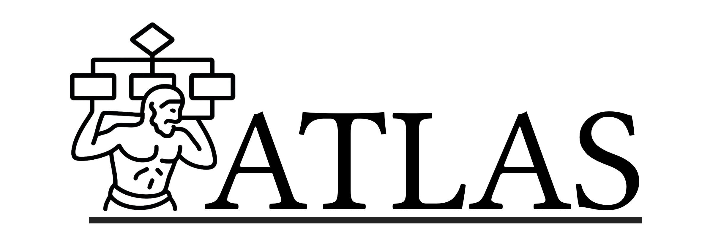

# ATLAS

ATLAS (Automated Transfer, Logging, Archiving, Structures) is a set of scripts that encompass the main workflow on Saga. The scripts ensures safe transfer, logging, and archiving of studies, enabling better collaboration, structure, and reproducibility. Please check the Wiki for more information!
