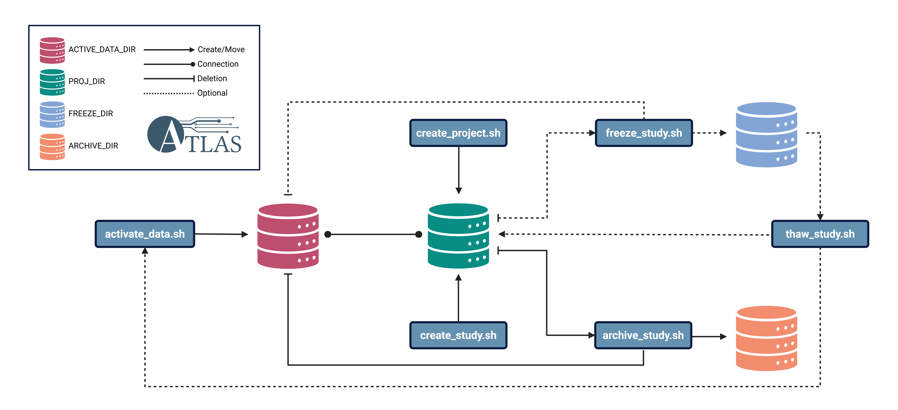

# Core concepts

Conceptually, ATLAS follows six core concepts: Project, Study, Activation, Freezing, Thawing, and Archiving. All of these concepts work together to enable reproducible and collaborative analyses of sequencing data. The figure below summarises the workflow defined in ATLAS.

<em><strong>ATLAS Workflow:</strong> The data flow in ATLAS is summarised in the figure above. The depicted database figures in four colours represent the core locations in ATLAS: <code>ACTIVE_DATA_DIR</code> (red), <code>PROJ_DIR</code> (green), <code>FREEZE_DIR</code> (blue), and <code>ARCHIVE_DIR</code> (orange). First, the <code>create_project.sh</code> script generates a project directory in <code>PROJ_DIR</code>. Then, <code>activate_data.sh</code> activates data from tarball storage, and <code>create_study.sh</code> creates the study directory connected to the activated data in said project directory. The user then has the possibility to freeze the study temporarily with <code>freeze_study.sh</code>, which will pack and move the study directory to <code>FREEZE_DIR</code>, followed by removal of the connected activated data. The frozen data can then be thawed with <code>thaw_study.sh</code>, where the study will be moved back to the project directory, and the connected active data will be reconstituted automatically. Lastly, when the study is finished, the user can archive it permanently using the <code>archive_study.sh</code>, which will pack and move the study to <code>ARCHIVE_DIR</code>. Figure created in BioRender.</em>

***

### Project
A project is defined as a top-level entity, such as research project or a surveillance programme. The key function of the project is to group different studies together under the same top-level directory. This makes it easier to find the studies, and makes it easier to collaborate between colleagues. The project directory is designed to have a longer life-span than a study, as the project may for example be a permanent grouping, e.g. ringtests, surveillance, or other activities with no foreseeable end date. Within the scripts, the project directory is not controlled in any other way than the naming convention when it is generated, providing flexibility for the user. Lastly, the project directories are not removed by ATLAS, and if a project is complete this directory needs to be removed manually.

### Study
A study is a sub-level directory below the project, and the main working element in ATLAS. A study encompass a specific set of analyses, most often connected to a publication, a hypothesis, or a ring-test, for example. One project may have several studies, for example one per planned paper in a research project, or one per year and/or bacterium for surveillance projects. Creating separate studies like this allows flexibility, and makes it possible to freeze/thaw and archive these separately. This will free up more storage space on the system, making it easier to work with other people on the same system. A specific directory structure is generated when the study is created, enabling easy collaboration, as well as enforcing best-practice structures for data analysis. The study directory is directly connected to an active data directory, which acts as a pair. Each study directory only have one data directory. Data can also be appended to an existing study when necessary, without having to worry about updating logs and symlinks manually.

### Activation
Activating data is here defined as transferring data from tarballs to an active data directory. The concept is designed to only extract what you need, and not moving and unpacking whole tarballs. This ensures that a lot less storage space is used, and less data transfer. Activation also encompass validation and logging of file transfers, ensuring reproducibility. Read file identification is based on input `csv` file, where the script will find all read files in the tarballs matching the sample ID listed. Users also have the possibility of appending data to an existing study, with proper logging and transfer of the read files.

### Freezing/Thawing
Freezing involves temporarily packing and moving a study to a storage directory. This is especially useful when you don't expect to work on a study for a long time, freeing up space for others to use. Similarly, thawing moves the data from the storage directory back to the analysis directory, and reconstitutes the original active data automatically.

### Archive
Achiving a study is to permanently pack and move a study for long-term storage. This is done on complete studies. The idea is to create a tarball that can be shared, f.ex. in a research paper.
