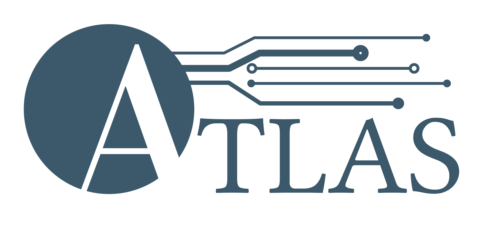

## Background
Working on a high-performance computing cluster poses several challenges: How can one make sure that users are more space-efficient? How can one create a file structure that encourages collaboration? How can one make it easier for users to clean up their data after analysis completion? And lastly, how can one work more reproducible and safe? Taking these questions into consideration, we created ATLAS (**A**utomated **T**ransfer, **L**ogging, **A**rchiving, and **S**tructures), a workflow concept for managing sequencing- and analysis data. The ATLAS scripts ensures that the data flow is safe and reproducible, and enables collaborative and structured analyses. It handles data transfer from sequencing storage to analysis, and enables temporary storage of analysis data not currently worked on, freeing up valuable disk space for other users. Further, the scripts allow for proper archiving of complete analysis data.

Navigate through the help pages for more information!
